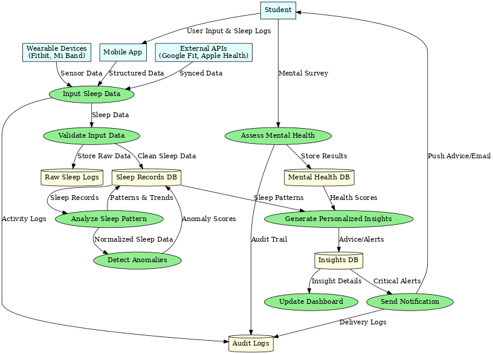
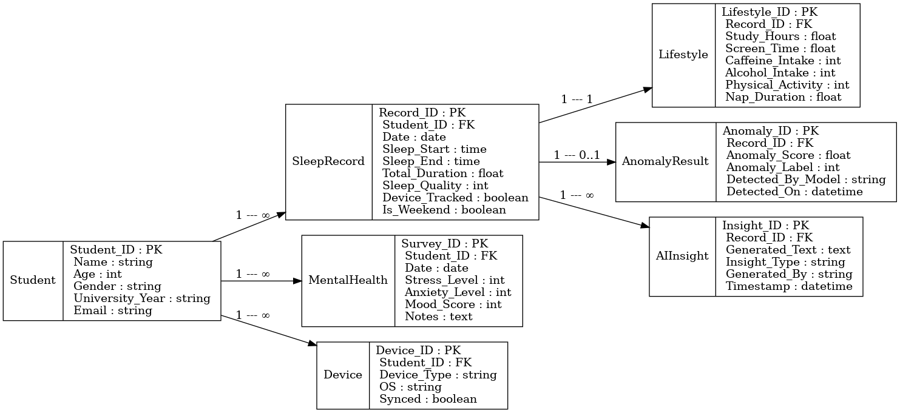

<div align="center">

# 🌙 Sleep Analysis Dashboard


*A comprehensive sleep analysis application that provides data visualization, AI-powered insights, and personalized sleep recommendations for students and sleep researchers.*

[](https://your-demo-link.com)
[](https://your-docs-link.com)

</div>

---

## 📌 Introduction

The **Sleep Analysis Dashboard** is an advanced web application designed to help students and researchers understand sleep patterns through comprehensive data analysis, interactive visualizations, and AI-powered insights. Built with modern web technologies, it offers a seamless experience for sleep data exploration and optimization.

> **💡 Key Insight**: This tool combines traditional data analysis with cutting-edge AI to provide personalized sleep recommendations that can significantly improve your sleep quality and overall well-being.

---

## 🚀 Features

### 📊 **Data Analysis & Visualization**
- **Multi-format Data Input**: CSV upload, manual entry, or sample data generation
- **Interactive Charts**: 6 different visualization types using Plotly
- **Real-time Analysis**: Instant statistical calculations and pattern recognition
- **Sleep Cycle Analysis**: Detailed breakdown of sleep stages (Awake, Light, Deep, REM)

### 🤖 **AI-Powered Intelligence**
- **Smart Chat Interface**: Interactive AI Sleep Expert powered by Groq's LLM
- **Personalized Recommendations**: Data-driven sleep optimization tips
- **Context-Aware Responses**: AI considers your specific sleep patterns
- **Sleep Science Education**: Learn about sleep health and best practices

### 🎨 **Modern User Experience**
- **Glassmorphism Design**: Beautiful, modern UI with blur effects and transparency
- **Responsive Layout**: Works perfectly on desktop, tablet, and mobile devices
- **Smooth Animations**: Engaging transitions and interactive feedback
- **Intuitive Navigation**: Easy-to-use interface with clear data flow

### 🔧 **Advanced Analytics**
- **Anomaly Detection**: Identifies unusual sleep patterns using ML algorithms
- **Correlation Analysis**: Studies relationships between lifestyle factors and sleep
- **Trend Analysis**: Tracks sleep patterns over time
- **Quality Scoring**: Comprehensive sleep quality assessment system

---

## 📸 Screenshots

<div align="center">

### 🏠 **Main Dashboard**


*The main dashboard showing sleep analysis overview with key metrics and navigation*

---

### 📊 **Data Visualizations**
<div style="display: flex; flex-wrap: wrap; justify-content: center; gap: 20px; margin: 20px 0;">


</div>

*Interactive visualizations showing sleep patterns, distributions, and correlations*

---

### 🤖 **AI Chat Interface**


*AI-powered chat interface providing personalized sleep advice and insights*

---

### 📈 **Advanced Analytics**
<div style="display: flex; flex-wrap: wrap; justify-content: center; gap: 20px; margin: 20px 0;">


</div>

*3D scatter plots and trend analysis for comprehensive sleep pattern understanding*

---

### 📝 **Data Entry & Management**
<div style="display: flex; flex-wrap: wrap; justify-content: center; gap: 20px; margin: 20px 0;">


</div>

*Flexible data input options and comprehensive output analysis*

</div>

---

## 🖼️ Project Diagrams

<div align="center">

### 🏗️ **System Architecture**


*High-level system architecture showing data flow and component interactions*

---

### 📋 **Use Case Diagram**


*User interactions and system capabilities overview*

---

### 🗃️ **Database Schema (ER Diagram)**


*Entity-Relationship diagram showing data structure and relationships*

---

### 🏛️ **Class Diagram**


*Object-oriented design showing class relationships and methods*

</div>

---

## 🛠️ Tech Stack

<div align="center">

| Category | Technology | Version | Purpose |
|----------|------------|---------|---------|
| **🌐 Frontend** | Streamlit | 1.35.0 | Web application framework |
| **🐍 Backend** | Python | 3.8+ | Core programming language |
| **📊 Data Processing** | Pandas | 2.2.2 | Data manipulation & analysis |
| **🔢 Numerical Computing** | NumPy | 1.26.4 | Mathematical operations |
| **📈 Visualization** | Plotly | 5.22.0 | Interactive charts & graphs |
| **🤖 Machine Learning** | Scikit-learn | 1.5.0 | ML algorithms & analysis |
| **🧠 AI/LLM** | Groq API | Latest | AI-powered chat functionality |
| **🎨 Styling** | HTML/CSS | - | Custom UI components |
| **⚙️ Configuration** | python-dotenv | 1.0.1 | Environment management |

</div>

### 🔧 **Key Dependencies**

```python
# Core Framework
streamlit==1.35.0

# Data Science Stack
pandas==2.2.2
numpy==1.26.4
plotly==5.22.0
scikit-learn==1.5.0

# AI Integration
groq>=0.30.0

# Utilities
python-dotenv==1.0.1
```

---

## ⚙️ Installation

### 📋 **Prerequisites**

- **Python 3.8+** installed on your system
- **Git** for cloning the repository
- **Groq API Key** (for AI chat functionality)

### 🚀 **Quick Start**

```bash
# 1. Clone the repository
git clone https://github.com/yourusername/sleep-analysis.git
cd sleep-analysis

# 2. Create virtual environment (recommended)
python -m venv sleep-env
source sleep-env/bin/activate  # On Windows: sleep-env\Scripts\activate

# 3. Install dependencies
pip install -r requirements.txt

# 4. Set up environment variables
echo "GROQ_API_KEY=your_groq_api_key_here" > .env

# 5. Run the application
streamlit run app.py
```

### 🔑 **API Key Setup**

1. **Get Groq API Key**:
   - Visit [Groq Console](https://console.groq.com/)
   - Sign up for a free account
   - Generate an API key

2. **Configure Environment**:
   ```bash
   # Create .env file
   echo "GROQ_API_KEY=your_actual_api_key_here" > .env
   echo "DEBUG=false" >> .env
   ```

### 🐳 **Docker Installation** (Optional)

```bash
# Build Docker image
docker build -t sleep-analysis .

# Run container
docker run -p 8501:8501 -e GROQ_API_KEY=your_key sleep-analysis
```

---

## 📖 Usage

### 🎯 **Getting Started**

1. **Launch the Application**:
   ```bash
   streamlit run app.py
   ```

2. **Access the Dashboard**:
   - Open your browser to `http://localhost:8501`
   - The application will load with sample data

3. **Choose Data Source**:
   - **📁 Upload CSV**: Upload your sleep data file
   - **✏️ Manual Entry**: Enter data through the form
   - **📊 Sample Data**: Use pre-generated sample data

### 📊 **Data Analysis Workflow**


### 🤖 **AI Chat Features**

- **Ask Questions**: "How can I improve my sleep quality?"
- **Get Insights**: "What do my sleep patterns tell me?"
- **Receive Tips**: "What lifestyle changes should I make?"
- **Learn Science**: "Explain the different sleep stages"

### 📈 **Visualization Types**

| Chart Type | Purpose | Data Shown |
|------------|---------|------------|
| **Box Plot** | Distribution Analysis | Sleep duration by university year |
| **Scatter Plot** | Correlation Study | Study hours vs sleep quality |
| **Sunburst** | Sleep Cycles | Sleep stage distribution |
| **3D Scatter** | Multi-dimensional | Screen time, activity, sleep duration |
| **Line Chart** | Trend Analysis | Sleep patterns over time |
| **Bar Chart** | Comparative Analysis | Sleep metrics comparison |

---

## 🤝 Contributing

We welcome contributions from the community! Here's how you can help:

### 🛠️ **Development Setup**

```bash
# Fork and clone the repository
git clone https://github.com/yourusername/sleep-analysis.git
cd sleep-analysis

# Create feature branch
git checkout -b feature/amazing-feature

# Install development dependencies
pip install -r requirements.txt
pip install -r requirements-dev.txt  # If available

# Make your changes and test
python -m pytest tests/

# Commit and push
git commit -m "Add amazing feature"
git push origin feature/amazing-feature
```

### 📝 **Contribution Guidelines**

- **🐛 Bug Reports**: Use GitHub Issues with detailed descriptions
- **✨ Feature Requests**: Submit enhancement ideas
- **📚 Documentation**: Help improve docs and examples
- **🧪 Testing**: Add tests for new features
- **🎨 UI/UX**: Improve user experience and design

### 🔄 **Pull Request Process**

1. Fork the repository
2. Create your feature branch (`git checkout -b feature/AmazingFeature`)
3. Commit your changes (`git commit -m 'Add some AmazingFeature'`)
4. Push to the branch (`git push origin feature/AmazingFeature`)
5. Open a Pull Request

---

## 📄 License

This project is licensed under the **MIT License** - see the [LICENSE](LICENSE) file for details.

```
MIT License

Copyright (c) 2024 Sleep Analysis Dashboard

Permission is hereby granted, free of charge, to any person obtaining a copy
of this software and associated documentation files (the "Software"), to deal
in the Software without restriction, including without limitation the rights
to use, copy, modify, merge, publish, distribute, sublicense, and/or sell
copies of the Software, and to permit persons to whom the Software is
furnished to do so, subject to the following conditions:

The above copyright notice and this permission notice shall be included in all
copies or substantial portions of the Software.
```

---

## ⭐ Support

### 🆘 **Getting Help**

- **📚 Documentation**: Check the [Wiki](https://github.com/kahafsameer/sleep-analysis/wiki)
- **🐛 Bug Reports**: [GitHub Issues](https://github.com/kahafsameer/sleep-analysis/issues)
- **💬 Discussions**: [GitHub Discussions](https://github.com/kahafsameer/sleep-analysis/discussions)
- **📧 Email**: sameerkahaf920@gmail.com

### 🌟 **Show Your Support**

If you find this project helpful, please consider:

- ⭐ **Starring** the repository
- 🍴 **Forking** for your own use
- 🐛 **Reporting** bugs and issues
- 💡 **Suggesting** new features
- 📢 **Sharing** with others

### 🎯 **Roadmap**

- [ ] **Mobile App**: Native iOS/Android applications
- [ ] **Sleep Tracking**: Integration with wearable devices
- [ ] **Advanced ML**: More sophisticated sleep prediction models
- [ ] **Multi-language**: Support for multiple languages
- [ ] **Cloud Deployment**: One-click deployment options

---

<div align="center">

## 🌟 **Built with ❤️ for Better Sleep Health**

*Empowering individuals to understand and optimize their sleep patterns through data-driven insights and AI-powered recommendations.*

---

### 🔗 **Quick Links**

[](https://github.com/yourusername/sleep-analysis)
[](https://github.com/yourusername/sleep-analysis/wiki)
[](https://github.com/yourusername/sleep-analysis/issues)
[](https://github.com/yourusername/sleep-analysis/discussions)

---

**Made with ☕ and 💤 by the Sleep Analysis Team**


</div>
